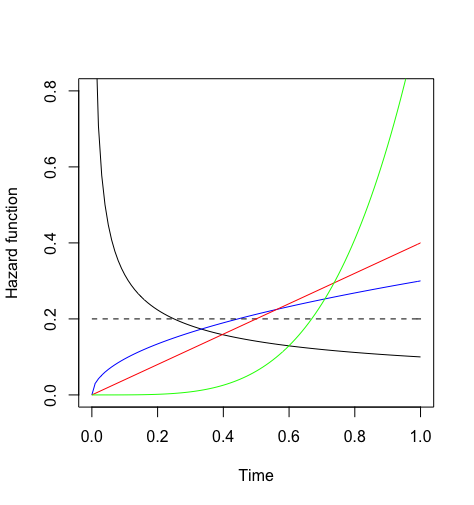

class: middle
# Aims

.full-width[.content-box-red[.bold[To introduce some of the main concepts which underlie the analysis of survival data]]]

.big[
- Describe the features of survival data
- Describe distributions of survival times
    - hazard function, survival function, and distribution functions
- Outline some particular distributions for survival times with different features
- Prepare data for survival analysis in R
- Estimate the parameters in R and interpret
]

---
class: middle, center, inverse

# What is survival analysis?

---
class: middle 

# Background

.full-width[.content-box-red[.bold[Survival analysis is the **study of times** at which some outcome or event of interest occurs.]]]

.big[
- Example of outcomes of interest in survival analysis: 
  - death (all causes)
  - death following a disease diagnosis
  - diagnosis of a disease
- Terminology <br>
The time at which the event occurs is referred to as a **survival/failure/event time**.
]

---
class: middle

# Examples of survival study

.big[
- .bold[Studying the patterns of survival in a given population over a particular time scale]
<br> For a person born in the UK/US/Japan in a particular year, what is the probability that the person lives to age 5, 40, 100? 
  
- .bold[Comparing survival times for individuals in two groups, or several groups.]
<br> After diagnosis, do patients receiving a new treatment have better survival prospects than patients receiving a standard treatment.
]  

---
class: middle

# Examples of survival study

.big[
- .bold[Studying the effects of several continuous and categorical variables on survival times, taking into account possible confounding]
<br>How is adult BMI associated with time to disease diagnosis after controlling for potential confounders?

- .bold[Predicting future survival based on features of an individual]
<br> What is the probability that an individual with features x,y,x will survive 5 years following a cancer diagnosis?
]

---
class: middle

# Where do we find survival data?

.big[
- In national **registers of births and deaths**

- In **randomized controlled trials**, where it is of interest to study whether individuals with a particular medical condition who were randomized to a new treatment tended to live longer than individuals randomized to the standard treatment. 

- In **prospective observational studies (cohort studies)**
]

---
class: middle

## Time scale for outcome: death from all causes


.full-width[.content-box-red[.bet[.bold[Considering all causes of death in a general population, such as the UK population, the time of origin is date of birth and the survival time may be measured by age in years.]]]]

 


---
class: top

## Time scale for outcome: acute graft-versus host disease following bone marrow transplantation


.full-width[.content-box-red[.bet[.bold[Individuals who receive a bone marrow transplant are followed up from the date of transplant till the date when outcome occurs]]]]

.bottom[
 
]

---
class: top

### Example 1.1: Survival of leukaemia patients in an observational study

.middlebottom[

]

???
- Survival times (time to death) in weeks of 33 leukaemia patients. 
- They are divided into two groups according to a characteristics of their white blood cells (AG +/-)
- Time of origin is date of diagnosis with leukaemia, and the time scale is time in weeks since diagnosis. 


---
class: middle 

## Censoring

.large[
- A particular feature that always arises in survival data from studies of human health is that not all individuals are observed to have the outcome of interest.

- We say that **their survival time is "censored"**.
]

.full-width[.content-box-red[.bold[**Administrative censoring**<br> .bet[if individuals are followed up for the outcome "death", then we may wish to perform some analysis of the data before the point at which all members of the cohort have died.]]]]


---
class: middle

## Other types of censoring

.full-width[.content-box-red[.bold[**Loss to follow-up** <br> .bet[In both intervention studies and observational studies some individuals may be lost to follow-up, meaning that the investigators lose contact with them.]]]]

.full-width[.content-box-red[.bold[**Death from other causes** <br> .bet[If we are interested in time to disease diagnosis then some individuals in the study population will never be diagnosed with the disease of interest and will die from another cause.]]]]

???

It is possible to have all of these types of censoring.


---
class: middle

## Feature of survival data: censoring

.large[
- Instead of observing the time of the outcome for each individual (the survival time), for some individuals we only observe a time up to which we know they have not had the outcome.

- This is referred to as **right censoring** and it must be accounted for in our analyses. 

- **The information from censored survival times is still informative - it tells us a person lived at least that long.** 
]

---
class: middle

## An important assumption for censoring

.large[
.full-width[
.content-box-red[.bold[
- It will be assumed that **censoring is uninformative about event times**.

- This means that the time at which an individual is censored, or the fact that they are censored, does not give us any information about when that person may/may not have the event.
]]
]
]

---
class: top

## Left-truncations

.large[
- **Left-truncation** is another feature of some survival data - also called **delayed entry**
]

.rightbottom[
 
]

---
class: top

## Example 1.2: Time to remission for leukaemia patients

.middle1bottom[
 
]

???
How can we compare the survival times in the treatment and control groups? considering the censoring?


---
class: middle, center, inverse

# Analysis of survival data


---
class: middle

# Simple analyses

.large[
The patterns of observed survival times can be analyzed in a simple way:

- by looking at histograms of survival times
- by producing summary statistics, e.g. median survival times
]

---
class: top, center
background-image: url("./fig/Histime.png")
background-position: 50% 50%
background-size: contain

<!-- # Simple analyses -->
<!--   -->


---
class: middle

# Simple ananlyses 

.large[
- But how do we accommodate **censoring**?

- Perhaps by summarising survival times and censoring times separately:
    - range of event and censoring times
    - median event time, median censoring time

- To make progress, we need to be able to describe survival times in a formalised way. 
]

---
class: middle

# Simple analyses

.large[
- Simple summaries could be extended to look separately within two or more different exposure groups. 

- But we can do better

- In order to adjust for confounders (continuous/categorical variables) we need to use **regression-based approaches**.

- Methods of analysis need to handle censoring and need to allow for the fact that **survival times are strictly non-negative**
]

---
class: middle

# Analysing survival data

.large[
- Fully parametric methods [1,3,6]

- Non-parametric methods [2]

- Semi-parametric methods [4,5,..]
    - including the Cox proportional hazard model
]

---
class: center, inverse, middle

# Describing survival data


---
class: middle

# Preliminaries

.big[
- All of the methods we consider depend on us being able to describe survival data in way which is meaningful for the question of interest

- We define **a random variable** $T$, which represents survival time
]

.full-width[
.content-box-red[.bold[
.bet[Three ways in which the distribution of the random variable $T$ can be described: (they are all related)
1. The survival function
2. The hazard function
3. The probability density function.
]]]
]

---
class: middle

# The survivor function

.full-width[
.content-box-red[
.bold[
**Definition** 
The survivor function at a time $t$ is the probability that the survival time $T$ exceeds a value $t$:
$$S(t) = \text{Pr}(T>t)$$
]
]
]

**Example:** if $T$ denotes age at death in the population, then the survivor function at age 80 ( $t$ = 80 ) is $S(80) = \text{Pr}(T > 80)$. 

The relation to the cumulative distribution function is $F(t) = \text{Pr}(T \leqslant t) = 1 - \text{Pr}(T > t) = 1 - S(t)$


---
class: top
# The hazard function

.full-width[
.content-box-red[
.bold[
**Definition** the hazard function at time $t$ can be thought of as the probability that the outcome occurs in a (very) short time instant after $t$ given that the outcome did not occur up to time $t$, divided by the length of time $\delta$, therefore giving a rate. When $\delta \rightarrow 0$, it becomes smooth function over time
$$h(t) = \lim_{\delta \rightarrow 0}\frac{1}{\delta}\text{Pr}(t\leqslant T < t + \delta | T \geqslant t)$$
]
]
]

**Cumulative hazard** $H(t) = \int_0^t h(u) du$ 


---
class: middle, center

# Example from [https://understandinguncertainty.org/](https://understandinguncertainty.org/files/animations/Survival1/Survival.html)

(click the link in a chrome/firefox browser)


---
class: middle

# The probability density function

.full-width[
.content-box-red[
.bold[
**Definition** The probability density function at time $t$ is defined as
$$f(t) = \frac{d}{dt}F(t) = \lim_{\delta \rightarrow 0} \frac{1}{\delta}\text{Pr}(t \leqslant T < t + \delta)$$
]
]
]


---
class: middle 
# Describing survival distributions

.full-width[
.content-box-red[
.bold[
$$S(t) = \text{Pr}(T>t) \\h(t) = \lim_{\delta \rightarrow 0}\frac{1}{\delta}\text{Pr}(t\leqslant T < t + \delta | T \geqslant t) \\ f(t) = \lim_{\delta \rightarrow 0} \frac{1}{\delta}\text{Pr}(t \leqslant T < t + \delta)$$
]
]
]

---
class: middle

## **Relationships between** $S(t), h(t), H(t), f(t)$

.pull-left[.small[
$$
\begin{aligned}
f(t) & = \frac{\text{d}}{\text{d}t}F(t)  = \frac{\text{d}}{\text{d}t}\{ 1-S(t) \}  \\ &= - \frac{\text{d}}{\text{d}t}S(t) \\
S(t) & = 1 - F(t)  = 1 - \int_0^t f(u)\text{d}u \\ &= \int_t^\infty f(u)\text{d}u \\
h(t) & = \lim_{\delta\rightarrow0}\frac{1}{\delta}\text{Pr}(t \leqslant T < t+ \delta | T > t) \\
     & = \lim_{\delta\rightarrow0}\frac{1}{\delta}\frac{\text{Pr}(t \leqslant T < t+ \delta, T > t)}{\text{Pr}(T > t)} \\  &(\text{Bayes' Theroem}) \\
     & = \lim_{\delta\rightarrow0}\frac{1}{\delta}\frac{\text{Pr}(t \leqslant T < t+ \delta)}{\text{Pr}(T > t)} = \frac{f(t)}{S(t)}\\
\end{aligned}
$$
]]

.pull-right[.small[
$$
\begin{aligned}
h(t) & = \frac{f(t)}{S(t)} = \frac{\frac{\text{d}}{\text{d}t}F(t)}{S(t)}  \\
     & = \frac{- \frac{\text{d}}{\text{d}t}S(t)}{S(t)} \\ 
     & = -\frac{d\log[S(t)]}{dS(t)}\cdot\frac{dS(t)}{dt}  \\ 
     & = - \frac{\text{d}}{\text{d}t}\text{log}[S(t)] (\text{chain rule}) \\
\end{aligned}
$$
]]


---
class: middle, center, inverse

# Parametric Distributions of <br>survival times


---
class: middle

# The simplest distribution for survival data

.full-width[.content-box-red[.bold[.large[
**The exponential distribution (指數分佈)** under the exponential distribution the hazard rate is constant over time: $\lambda$: 

$$
h(t) = \lambda, \;\;\; S(t) = e^{-\lambda t},  \;\;\; f(t) = \lambda e^{-\lambda t}
$$
]]]]


---
class: top, center
background-image: url("./fig/ExpoentialDistr.png")
background-position: 50% 50%
background-size: contain


---
class: middle

# Another distribution for survival times

.large[
- The exponential distribution will often be unsuitable for studies of human health because we usually expect that **the rate at which the outcome occurs will change over time**. 

- i.e. the hazard function $h(t)$ is not constant

- e.g. the death rate increases with increasing age
]

.full-width[.content-box-red[
**The Weibull distribution**: 
$h(t)  = \kappa\lambda t^{\kappa - 1} ; \;\;\; S(t)  = \exp(-\lambda t^\kappa) ; \;\;\; f(t)  = \kappa \lambda t^{\kappa - 1} \exp(-\lambda t^\kappa)$
]]


---
class: middle

# The Weibull distribution

.full-width[.content-box-red[.large[
**The Weibull distribution has 2 parameters, allowing flexibility in the shape of the hazard function**:] 
$$
h(t)  = \kappa\lambda t^{\kappa - 1} ; \;\;\; S(t)  = \exp(-\lambda t^\kappa) ; \;\;\; f(t)  = \kappa \lambda t^{\kappa - 1} \exp(-\lambda t^\kappa)
$$
]]


---
class: top, center
background-image: url("./fig/WeibullDistr.png")
background-position: 50% 50%
background-size: contain

---
class: middle

# Other distributions

.large[
- There are many other distributions for survival data which have different features

- In the practical we will explore about log-logistic distribution
]


---
class: middle
# Estimating the parameters of survival distributions

.big[
- Suppose we have decided on a suitable distribution for our survival data, e.g. exponential, Weibull.
- We can estimate the parameters of the survival distribution by **maximum likelihood estimation**
]

.full-width[.content-box-red[**Notation:** population of $n$ individuals $(i = 1, \dots, n)$
- Some individuals have outcome with **survival time** $t_{E_i}$
- Some individuals are censored with **time of censoring** $t_{C_i}$]]


---
class: middle

# Before looking at the data

.full-width[.content-box-red[.large[**Notation:** population of $n$ individuals $(i = 1, \dots, n)$
- Some individuals have outcome with **survival time** $t_{E_i}$
- Some individuals are censored with **time of censoring** $t_{C_i}$

$$\delta_{i}=\left\{ \begin{array}{ll}
1 \text{ if } t_{E_i} \text{ observed} \\
0 \text{ if }  t_{C_i} \text{ observed}\\ \end{array} \right.
t_{i}=\left\{ \begin{array}{ll}
t_{E_i} \text{ if } \delta_i = 1 \\
t_{C_i} \text{ if } \delta_i = 0 \\ \end{array} \right.$$
]]]

---
class: middle

# The data

```{r Surv01tab00, echo=FALSE, cache=TRUE, eval=FALSE}
library(kableExtra)
dt <- read.csv("data/Survtab0101.csv", header = T)
#names(dt) <- c("Model with", "sigma_u", "sigma_e", "sigma_u", "sigma_e")
kable(dt, "html",  align = "l", caption = "Table: Data on survival and censoring times for n individuals") %>%
  kable_styling(bootstrap_options = c("striped", "bordered"),full_width = F, position = "center") #%>%
  #add_header_above(c("Level" = 2))
```


| Individual | Survival or <br> censoring time | Indicator of <br> outcome or censoring |
|------------|---------------------------------|----------------------------------------|
| $1$          | $t_1$                               | $\delta_1$                                      |
| $2$          | $t_2$                               | $\delta_2$                                      |
| $3$          | $t_3$                               | $\delta_3$                                      |
| .          | .                               | .                                      |
| .          | .                               | .                                      |
| .          | .                               | .                                      |
| $n$          | $t_n$                               | $\delta_n$                                      |


---
class: middle

# The actual data

| Individual | Date of <br> time origin | Date of event <br> or censoring | Indicator of <br> outcome or censoring |
|------------|--------------------------|---------------------------------|----------------------------------------|
| $1$          | 20Jan2012                | 05Dec2012                       | $1$                                      |
| $2$          | 04Nov2012                | 31Dec2013                       | $0$                                      |
| $.$          | .                        | .                               | $.$                                      |
| $.$          | .                        | .                               | $.$                                      |
| $.$          | .                        | .                               | $.$                                      |
| $n$          | 27Feb2012                | 31Dec2013                       | $0$                                      |


---
class: middle

# Likelihoods for survival data

.large[
IF we had no censoring to worry about then the likelihood for survival data would take the same form as the likelihoods for continuous data: 

$$
L = \prod_{i = 1}^n f(t_i)
$$


Where $f(t_i)$ is the **probability density function**. 
<br>Examaple of exponential distribution: $L = \prod_{i = 1}^n\lambda e^{-\lambda t_i}$
]


---
class: middle

# Incorporating censoring into the likelihood

.large[
- For a censored individual $i$, we observe that the person survived at least up to time $t_i$ 
- The probability that their unobserved survival time is beyond $t_i$ is the survivor function $S(t_i) = \text{Pr}(T > t_i)$
]

.full-width[.content-box-red[
.large[**Full likelihood for survival data with censoring:**] 
$$L = \prod_{\text{Survival times}} f(t_{E_i})\color{darkred}{\prod_{\text{censoring times}}S(t_{C_i})}$$
]]

---
class: middle 

# Maximum likelihood estimates


.large[**Full likelihood for survival data with censoring:**] 

$$
\begin{aligned}
L & = \prod_{\text{Survival times}} f(t_{E_i})\color{darkred}{\prod_{\text{censoring times}}S(t_{C_i})} \\
  & = \prod_{i = 1}^n f(t_i)^{\delta_i} S(t_i)^{1 - \delta_i} \\
\log L & = \sum_{i = 1}^n\delta_i \log f(t_i) + \sum_{i = 1}^n (1 - \delta_i) \log S(t_i) \\ 
\text{MLEs:} & \;\;\;\;\; \frac{d \log L}{d\theta} = 0
\end{aligned}
$$


---
class: middle, center, inverse

# Practical


---
class: middle

# Data

.large[
- Primary Biliary Cirrhosis (PBC) data: this data is from a multicentre, double-blind, clinical trial for the treatment of Primary Biliary Cirrhosis (PBC) ([file](data/pbcbase.dta) as `.dta`)
- Whitehall Study data: this is a cohort study started in 1967, of risk factors for mortality in British male civil servants employed in various government departments. ([file](data/whitehall.dta) as `.dta`)
]

---
class: middle

# Read in the PBC data

.pull-left[
.large[
What is given in the following variables?] `d, datein, dateout, time`
{{content}}
]


.pull-right[.med[
```{r}
library(haven)
pbcbase <- read_dta("data/pbcbase.dta")
head(pbcbase[,1:5])
```
]
]


--
<br><br>`d`: the event indicator
{{content}}

--
<br>`datein`: date enter the study
{{content}}

--
<br>`dateout`: date when event occurred or censored
{{content}}

--
<br>`time`: the time difference in years 
{{content}}


---
class: middle

# What do you think is the appropriate time scale in the PBC study?

--
.large[
This is a trial comparing two treatments. individuals entered the trial at the date given in `datein` and exited at `dateout` (due to death or censoring). The appropriate time scale is **time of follow-up**. The aim is to compare the length of survival of individuals randomized to the two treatments. 
]


---
class: middle

# How many individuals have the outcome of interest (death) and how many are censored?

--
```{r message=FALSE, eval=FALSE}
library(tidyverse)
pbcbase %>% 
  group_by(d) %>% 
  summarise(n= n(), mean_y = mean(time), 
             med_y = median(time), min_y = min(time),
             max_y = max(time)) %>%
  mutate(rel.freq = paste0(round(100 * n/sum(n), 2), "%"))  
```

--
```
      d     n mean_y med_y  min_y max_y rel.freq
  <dbl> <int>  <dbl> <dbl>  <dbl> <dbl> <chr>   
1     0    95   4.59  4.62 0      11.6  49.74%  
2     1    96   3.24  2.85 0.0246  9.26 50.26% 
```

???
There are 96 deaths and 95 censored survival times. The first death occurred 0.025 years after the start of follow-up and the last death occurred 9.26 years after the start of follow-up. The minimum censoring time was 0 years, meaning that one or more individuals were not seen again after they joined the study. The individual who was followed up for the longest was observed until 11.64 years after joining the study, at which time they were censored. The median time of death was 2.85 years after the start of follow up and the median time of follow-up for censored individuals was 4.62 years. Because this is a trial, for a report it would also be a good idea to report summary statistics such as those given here separately by treatment group. There are 96 deaths and 95 censored survival times. The first death occurred 0.025 years after the start of follow-up and the last death occurred 9.26 years after the start of follow-up. The minimum censoring time was 0 years, meaning that one or more individuals were not seen again after they joined the study. The individual who was followed up for the longest was observed until 11.64 years after joining the study, at which time they were censored. The median time of death was 2.85 years after the start of follow up and the median time of follow-up for censored individuals was 4.62 years. Because this is a trial, for a report it would also be a good idea to report summary statistics such as those given here separately by treatment group. 

---
class: middle

# Dead in the Whitehall data


.pull-left[
What is given in the following variables? What is special about 30th Jan 1987?<br>`timein, timeout, timebth`{{content}}
]


.pull-right[
```{r}
whitehall <- read_dta("data/whitehall.dta")
head(whitehall[,c(12:14)])
```
]


--
`timebth`: the date of birth
{{content}}

--
<br>`timein`: the date when individuals enter the study
{{content}}

--
<br>`timeout`: the date of the end of follow-up
{{content}}

--
<br>the last date of follow-up is 1987-01-30, **administratively censored**
{{content}}


---
class: middle

# What do you think is the appropriate time scale in the Whitehall study?

--
```{r eval=FALSE}
library(survival)
# `Use the time-in-study` as the time scale
M0 <- survfit(Surv(time = (`timeout - timein`)/365.25, event = chd)~1, 
              data = whitehall)
summary(M0$time)
```

--
```
 Min. 1st Qu.  Median    Mean 3rd Qu.    Max. 
 0.1506  9.9274 16.6777 13.9595 18.1881 19.3812 
```


---
class: middle

# What do you think is the appropriate time scale in the Whitehall study?


```{r eval=FALSE}
# `Consider age as the time scale`
M2 <- survfit(Surv((`timeout - timebth`)/365.25, event = chd) ~ 1, 
              data = whitehall)
summary(M2$time)
```

--
```
 Min. 1st Qu.  Median    Mean 3rd Qu.    Max. 
  44.39   63.82   67.99   68.64   73.64   85.77 
```

--
This may seem to be OK because age is an important factor in CHD death. 

--
**However, this time scale does not account for the fact that individuals in the study had to survive until the time of entry.**


---
class: middle


# What do you think is the appropriate time scale in the Whitehall study?


```{r eval=FALSE}
# `Age as time scale` 
M1 <- survfit(Surv(`agein, agein + (timeout - timein)/365.25`, 
                   event = chd) ~ 1, data = whitehall)
summary(M1$time)
```

--
```
Min. 1st Qu.  Median    Mean 3rd Qu.    Max. 
  44.39   63.82   67.89   68.57   73.46   85.77
```

--
**This approach allowed "left-truncation", but also consider the fact that some individuals had to survive until `timein` to be observed**


---
class: middle

# Part 2: Fitting models to survival data


.large[
In the file [surv_data_practical1.csv](data/surv_data_practical1.csv), you will find some artificial survival data for 100 individuals from an exponential distirbution hazard $\lambda = 0.2165$
]

.pull-left[.med[
```{r eval=FALSE}
mydata <- read_csv("data/surv_data_practical1.csv")
head(mydata)
```
]
]


.pull-right[
```
  surv.times
       <dbl>
1      0.442
2      2.01 
3      2.26 
4      1.64 
5      9.88 
6      1.19 
```
]

---
class: middle

# The exponential model is fitted as:

```{r eval=FALSE}
exp.model <- survreg(Surv(surv.times) ~ 1, 
                     dist = "exponential",
                     data = mydata)
summary(exp.model)
```
--
```
Call:
survreg(formula = Surv(surv.times) ~ 1, data = mydata, dist = "exponential")
            Value Std. Error    z      p
(Intercept)  `1.53`       0.10 15.3 <2e-16

Scale fixed at 1 

Exponential distribution
Loglik(model)= -252.7   Loglik(intercept only)= -252.7
Number of Newton-Raphson Iterations: 5 
n= 100 
```

???

`1.53` = -log(0.2165)

---
class: middle

# Explore Weibull distribution

.pull-left[
.med[
```{r eval=FALSE}
wei.haz <- function(x, lambda, kappa) {
 `lambda `*` kappa `*` x^(kappa - 1)`
}
curve(wei.haz(x, 0.2, 0.5), ylim = c(0,0.8), 
      xlab = "Time", ylab = "Hazard function")
curve(wei.haz(x, 0.2, 1.5), add = TRUE, col = "blue")
curve(wei.haz(x, 0.2, 1), add = TRUE, lty = 2)
curve(wei.haz(x, 0.2, 2), add = TRUE, col = "red")
curve(wei.haz(x, 0.2, 5), add = TRUE, col = "green")
```
]

$$
h(t)  = \kappa\lambda t^{\kappa - 1}
$$

]

.pull-right[
```{r echo=FALSE}

```

]
