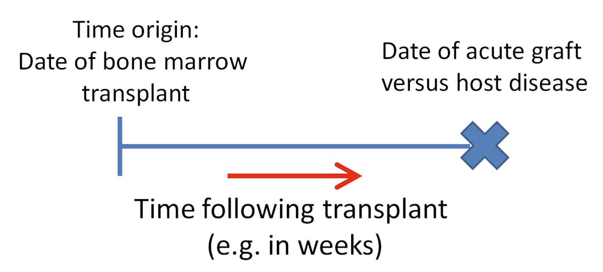

class: middle
# Aims

.full-width[.content-box-red[.bold[To introduce some of the main concepts which underlie the analysis of survival data]]]

.big[
- Describe the features of survival data
- Describe distributions of survival times
    - hazard function, survival function, and distribution functions
- Outline some particular distributions for survival times with different features
- Prepare data for survival analysis in R
- Estimate the parameters in R and interpret
]

---
class: middle, center, inverse

# What is survival analysis?

---
class: middle 

# Background

.full-width[.content-box-red[.bold[Survival analysis is the **study of times** at which some outcome or event of interest occurs.]]]

.big[
- Example of outcomes of interest in survival analysis: 
  - death (all causes)
  - death following a disease diagnosis
  - diagnosis of a disease
- Terminology  
The time at which the event occurs is referred to as a **survival/failure/event time**.
]

---
class: middle

# Examples of survival study

.big[
- .bold[Studying the patterns of survival in a given population over a particular time scale]
  For a person born in the UK/US/Japan in a particular year, what is the probability that the person lives to age 5, 40, 100? 
  
- .bold[Comparing survival times for individuals in two groups, or several groups.]
  After diagnosis, do patients receiving a new treatment have better survival prospects than patients receiving a standard treatment.
]  

---
class: middle

# Examples of survival study

.big[
- .bold[Studying the effects of several continuous and categorical variables on survival times, taking into account possible confounding]
 How is adult BMI associated with time to disease diagnosis after controlling for potential confounders?

- .bold[Predicting future survival based on features of an individual]
  What is the probability that an individual with features x,y,x will survive 5 years following a cancer diagnosis?
]

---
class: middle

# Where do we find survival data?

.big[
- In national **registers of births and deaths**

- In **randomized controlled trials**, where it is of interest to study whether individuals with a particular medical condition who were randomized to a new treatment tended to live longer than individuals randomized to the standard treatment. 

- In **prospective observational studies (cohort studies)**
]

---
class: middle

## Time scale for outcome: death from all causes

.full-width[.content-box-red[.bet[.bold[Considering all causes of death in a general population, such as the UK population, the time of origin is date of birth and the survival time may be measured by age in years.]]]]

 

---
class: top

## Time scale for outcome: acute graft-versus host disease following bone marrow transplantation

.full-width[.content-box-red[.bet[.bold[Individuals who receive a bone marrow transplant are followed up from the date of transplant till the date when outcome occurs]]]]

.bottom[
 
]

---
class: top

### Example 1.1: Survival of leukaemia patients in an observational study

.middlebottom[

]

???
- Survival times (time to death) in weeks of 33 leukaemia patients. 
- They are divided into two groups according to a characteristics of their white blood cells (AG +/-)
- Time of origin is date of diagnosis with leukaemia, and the time scale is time in weeks since diagnosis. 

---
class: middle 

## Censoring

.large[
- A particular feature that always arises in survival data from studies of human health is that not all individuals are observed to have the outcome of interest.

- We say that **their survival time is "censored"**.
]

.full-width[.content-box-red[.bold[**Administrative censoring**  .bet[if individuals are followed up for the outcome "death", then we may wish to perform some analysis of the data before the point at which all members of the cohort have died.]]]]

---
class: middle

## Other types of censoring

.full-width[.content-box-red[.bold[**Loss to follow-up**   .bet[In both intervention studies and observational studies some individuals may be lost to follow-up, meaning that the investigators lose contact with them.]]]]

.full-width[.content-box-red[.bold[**Death from other causes**   .bet[If we are interested in time to disease diagnosis then some individuals in the study population will never be diagnosed with the disease of interest and will die from another cause.]]]]

???

It is possible to have all of these types of censoring.

---
class: middle

## Feature of survival data: censoring

.large[
- Instead of observing the time of the outcome for each individual (the survival time), for some individuals we only observe a time up to which we know they have not had the outcome.

- This is referred to as **right censoring** and it must be accounted for in our analyses. 

- **The information from censored survival times is still informative - it tells us a person lived at least that long.** 
]

---
class: middle

## An important assumption for censoring

.large[
.full-width[
.content-box-red[.bold[
- It will be assumed that **censoring is uninformative about event times**.

- This means that the time at which an individual is censored, or the fact that they are censored, does not give us any information about when that person may/may not have the event.
]]
]
]

---
class: top

## Left-truncations

.large[
- **Left-truncation** is another feature of some survival data - also called **delayed entry**
]

.rightbottom[
 
]

---
class: top

## Example 1.2: Time to remission for leukaemia patients

.middle1bottom[
 
]

???
How can we compare the survival times in the treatment and control groups? considering the censoring?

---
class: middle, center, inverse

# Analysis of survival data

---
class: middle

# Simple analyses

.large[
The patterns of observed survival times can be analyzed in a simple way:

- by looking at histograms of survival times
- by producing summary statistics, e.g. median survival times
]

---
class: top, center
background-image: url("./fig/Histime.png")
background-position: 50% 50%
background-size: contain

<!-- # Simple analyses -->
<!--   -->

---
class: middle

# Simple ananlyses 

.large[
- But how do we accommodate **censoring**?

- Perhaps by summarising survival times and censoring times separately:
    - range of event and censoring times
    - median event time, median censoring time

- To make progress, we need to be able to describe survival times in a formalised way. 
]

---
class: middle

# Simple analyses

.large[
- Simple summaries could be extended to look separately within two or more different exposure groups. 

- But we can do better

- In order to adjust for confounders (continuous/categorical variables) we need to use **regression-based approaches**.

- Methods of analysis need to handle censoring and need to allow for the fact that **survival times are strictly non-negative**
]

---
class: middle

# Analysing survival data

.large[
- Fully parametric methods [1,3,6]

- Non-parametric methods [2]

- Semi-parametric methods [4,5,..]
    - including the Cox proportional hazard model
]

---
class: center, inverse, middle

# Describing survival data

---
class: middle

# Preliminaries

.big[
- All of the methods we consider depend on us being able to describe survival data in way which is meaningful for the question of interest

- We define **a random variable** $T$, which represents survival time
]

.full-width[
.content-box-red[.bold[
.bet[Three ways in which the distribution of the random variable $T$ can be described: (they are all related)
1. The survival function
2. The hazard function
3. The probability density function.
]]]
]

---
class: middle

# The survivor function

.full-width[
.content-box-red[
.bold[
**Definition** 
The survivor function at a time $t$ is the probability that the survival time $T$ exceeds a value $t$:
$$S(t) = \text{Pr}(T>t)$$
]
]
]

**Example:** if $T$ denotes age at death in the population, then the survivor function at age 80 ( $t$ = 80 ) is $S(80) = \text{Pr}(T > 80)$. 

The relation to the cumulative distribution function is $F(t) = \text{Pr}(T \leqslant t) = 1 - \text{Pr}(T > t) = 1 - S(t)$

---
class: top
# The hazard function

.full-width[
.content-box-red[
.bold[
**Definition** the hazard function at time $t$ can be thought of as the probability that the outcome occurs in a (very) short time instant after $t$ given that the outcome did not occur up to time $t$, divided by the length of time $\delta$, therefore giving a rate. When $\delta \rightarrow 0$, it becomes smooth function over time
$$h(t) = \lim_{\delta \rightarrow 0}\frac{1}{\delta}\text{Pr}(t\leqslant T < t + \delta | T \geqslant t)$$
]
]
]

**Cumulative hazard** $H(t) = \int_0^t h(u) du$ 

---
class: middle, center

# Example from [https://understandinguncertainty.org/](https://understandinguncertainty.org/files/animations/Survival1/Survival.html)

(click the link in a chrome/firefox browser)

---
class: middle

# The probability density function

.full-width[
.content-box-red[
.bold[
**Definition** The probability density function at time $t$ is defined as
$$f(t) = \frac{d}{dt}F(t) = \lim_{\delta \rightarrow 0} \frac{1}{\delta}\text{Pr}(t \leqslant T < t + \delta)$$
]
]
]

---
class: middle 
# Describing survival distributions

.full-width[
.content-box-red[
.bold[
$$S(t) = \text{Pr}(T>t) \\h(t) = \lim_{\delta \rightarrow 0}\frac{1}{\delta}\text{Pr}(t\leqslant T < t + \delta | T \geqslant t) \\ f(t) = \lim_{\delta \rightarrow 0} \frac{1}{\delta}\text{Pr}(t \leqslant T < t + \delta)$$
]
]
]

---
class: middle

## **Relationships between** $S(t), h(t), H(t), f(t)$

.pull-left[.small[
$$
\begin{aligned}
f(t) & = \frac{\text{d}}{\text{d}t}F(t)  = \frac{\text{d}}{\text{d}t}\{ 1-S(t) \}  \\ &= - \frac{\text{d}}{\text{d}t}S(t) \\
S(t) & = 1 - F(t)  = 1 - \int_0^t f(u)\text{d}u \\ &= \int_t^\infty f(u)\text{d}u \\
h(t) & = \lim_{\delta\rightarrow0}\frac{1}{\delta}\text{Pr}(t \leqslant T < t+ \delta | T > t) \\
     & = \lim_{\delta\rightarrow0}\frac{1}{\delta}\frac{\text{Pr}(t \leqslant T < t+ \delta, T > t)}{\text{Pr}(T > t)} \\  &(\text{Bayes' Theroem}) \\
     & = \lim_{\delta\rightarrow0}\frac{1}{\delta}\frac{\text{Pr}(t \leqslant T < t+ \delta)}{\text{Pr}(T > t)} = \frac{f(t)}{S(t)}\\
\end{aligned}
$$
]]

.pull-right[.small[
$$
\begin{aligned}
h(t) & = \frac{f(t)}{S(t)} = \frac{\frac{\text{d}}{\text{d}t}F(t)}{S(t)}  \\
     & = \frac{- \frac{\text{d}}{\text{d}t}S(t)}{S(t)} \\ 
     & = -\frac{d\log[S(t)]}{dS(t)}\cdot\frac{dS(t)}{dt}  \\ 
     & = - \frac{\text{d}}{\text{d}t}\text{log}[S(t)] (\text{chain rule}) \\
\end{aligned}
$$
]]

---
class: middle, center, inverse

# Parametric Distributions of  survival times

---
class: middle

# The simplest distribution for survival data

.full-width[.content-box-red[.bold[.large[
**The exponential distribution (指數分佈)** under the exponential distribution the hazard rate is constant over time: $\lambda$: 

$$
h(t) = \lambda, \;\;\; S(t) = e^{-\lambda t},  \;\;\; f(t) = \lambda e^{-\lambda t}
$$
]]]]

---
class: top, center
background-image: url("./fig/ExpoentialDistr.png")
background-position: 50% 50%
background-size: contain

---
class: middle

# Another distribution for survival times

.large[
- The exponential distribution will often be unsuitable for studies of human health because we usually expect that **the rate at which the outcome occurs will change over time**. 

- i.e. the hazard function $h(t)$ is not constant

- e.g. the death rate increases with increasing age
]

.full-width[.content-box-red[
**The Weibull distribution**: 
$h(t)  = \kappa\lambda t^{\kappa - 1} ; \;\;\; S(t)  = \exp(-\lambda t^\kappa) ; \;\;\; f(t)  = \kappa \lambda t^{\kappa - 1} \exp(-\lambda t^\kappa)$
]]

---
class: middle

# The Weibull distribution

.full-width[.content-box-red[.large[
**The Weibull distribution has 2 parameters, allowing flexibility in the shape of the hazard function.**:] 
$h(t)  = \kappa\lambda t^{\kappa - 1} ; \;\;\; S(t)  = \exp(-\lambda t^\kappa) ; \;\;\; f(t)  = \kappa \lambda t^{\kappa - 1} \exp(-\lambda t^\kappa)$
]]

---
class: top, center
background-image: url("./fig/WeibullDistr.png")
background-position: 50% 50%
background-size: contain

---
class: middle

# Other distributions

.large[
- There are many other distributions for survival data which have different features

- In the practical we will explore about log-logistic distribution
]